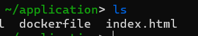

# Docker

# Docker file

Building the container image :

1→ First we need to create a dockerfile :

```docker
FROM nginx
COPY index.html /usr/share/nginx/html
EXPOSE 80
```



2→next in the application directory run the command:   `sudo docker build -t webapp .`

- params
    
    -t 
    
    `-q` : for quiet, it suppress the build output
    

# Docker Compose

creating new images from docker-compose.yml file.

Example : 

```yaml
version: '3.1'

services:

  db:
    image: postgres
    restart: always
    environment:
      POSTGRES_PASSWORD: "0000"

  adminer:
    image: adminer
    restart: always
    ports:
      - "8080:8080"
```

<aside>
🔴 Note : use “ ” if password isn’t working properly

</aside>

`***docker-compose up`:***

> In the directory containing the file use the Command ⇒ `docker-compose up`. You can add `-d` to run process in background.
> 

Error :


```bash
Stopping application_adminer_1 ... error
ERROR: for application_adminer_1  cannot stop container: 8b07e54adcfebb4fd40d0b8e224f3bff8e5b850be5c4e6779a7e86892ed805be: permission denied
```

Solution :

```bash
sudo aa-remove-unknown
sudo apparmor_parser -r /var/lib/snapd/apparmor/profiles/*
```

`***docker-compose down`:***

> Shutdown all the services
> 

`d***ocker-compose events`:***

> Receive real time events from containers in case for example stopping a container, deleting an image ….
> 

`d***ocker-compose logs` :***

> Receive real time events from containers in case for example stopping a container, deleting an image ….
> 

`***sudo docker-compose run`:***

> Run a one time command against a service
Examples: 
- `docker-compose run *service env` 
-* `docker-compose run *service bash`*
> 

# Creating a SWARM cluster docker

> A docker Swarm  is a group of physical/virtual machines that are running the docker application and have been configured to join together in a cluster.
The swarm **manager** control the cluster. While the other machines are called nodes.
> 
- Initializing the SWARM cluster manager
    - `docker swarm init`
    
    <aside>
    💡 When running this command it gives the other command to use when adding other nodes
    
    </aside>
    
- adding nodes to the SWARM cluster
    - `docker swarm join --token [token here] [@IP of manager machine]:[port]`
- Showing available nodes
    - `docker node ls`